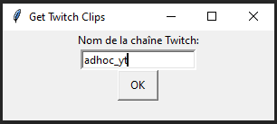
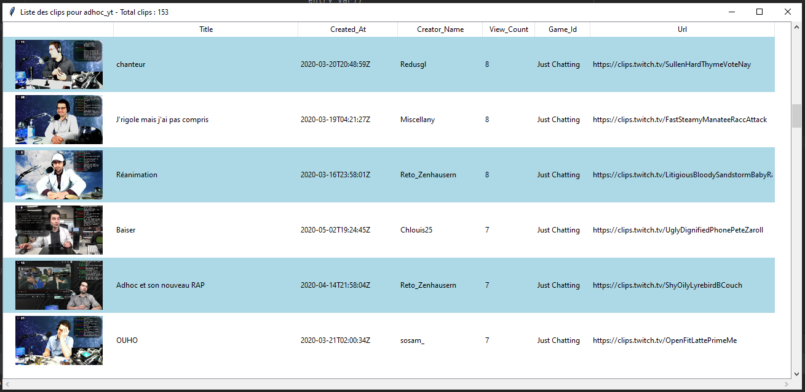

Get Twitch Clips
=========

Un utilitaire léger en Python pour retrouver tous les clips Twitch 
d'un streamer, puis de trier par titre, par date, par nombre de vues,
 _etc._

_[> Rediffusions de live coding](https://twitch.tv/adhoc_yt)_

##Installation

Téléchargez et exécutez [getTwitchClips.exe](getTwitchClips.exe)

##Utilisation

Lancez l'exécutable :

Dans la fenêtre qui s'affiche, tapez le nom du streamer puis appuyez sur
la touche Entrée ou cliquez sur le bouton OK. La collecte des clips va
commencer, puis une nouvelle fenêtre va s'afficher :

Double-cliquer sur un clip l'ouvrira dans votre navigateur.
Pour trier les clips, cliquez sur le critère de tri en haut de chaque
 colonne; comme dans un tableau interactif classique.

Vous pouvez lancer la recherche sur un autre streamer lorsqu'une collection
 de clips a fini de charger.

##Upcoming features

Une barre de recherche et un panneau de login non-developpeur